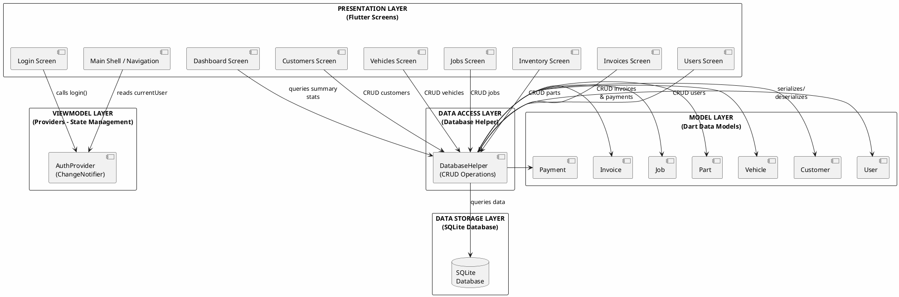
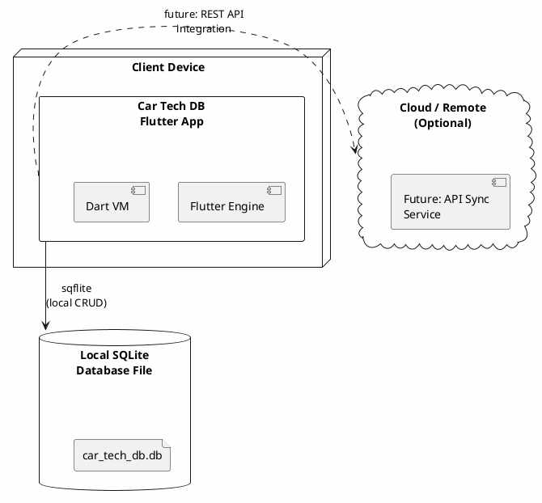
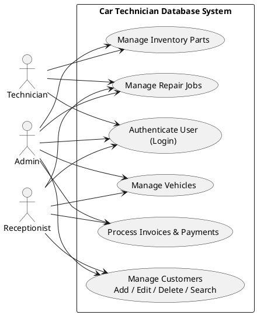
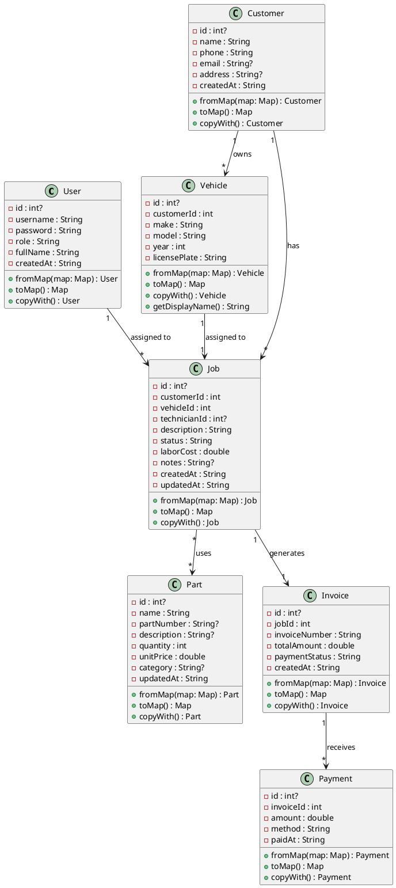
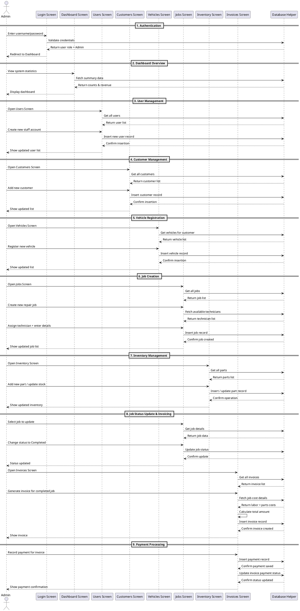
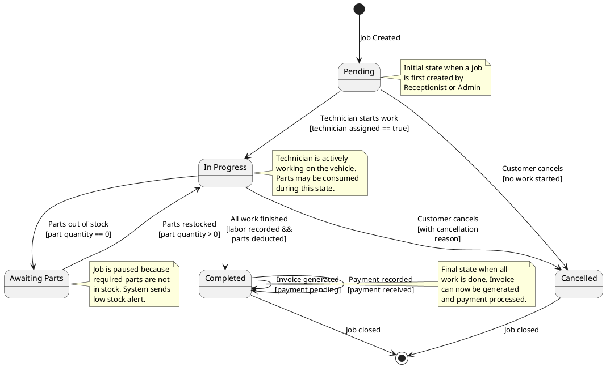
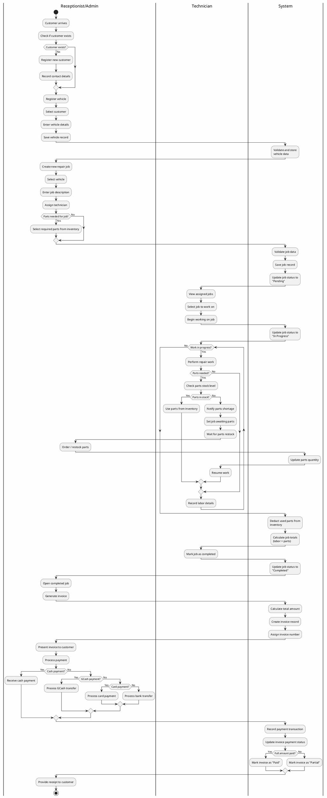

# Car Technician Database System
## UML Diagrams & Documentation

---

## SYSTEM OVERVIEW
This is a workshop management application for automobile repair shops. The system handles customer records, vehicle information, repair jobs tracking, parts inventory, invoicing and payment processing with role-based access control.

---

## ACTORS & ROLES
    | Actor | System Role | Permissions |
    |---|---|---|
    | **Admin** | System Administrator | Full access, manage user accounts, view all reports |
    | **Technician** | Repair Technician | View assigned jobs, update job status, view inventory |
    | **Receptionist** | Front Desk Staff | Manage customers, vehicles, create jobs, process invoices, record payments |

---

## ARCHITECTURAL GENRE

The Car Technician Database System follows a **Layered Architecture** pattern combined with **MVVM (Model-View-ViewModel)** design pattern, common in Flutter applications that use the `provider` package for state management.

### Why Layered Architecture + MVVM?

| Layer | Technology / Component | Responsibility |
|---|---|---|
| **View / Presentation Layer** | Flutter Screens (`lib/screens/`) | UI rendering, user interaction, input handling |
| **ViewModel / Business Logic Layer** | Providers (`lib/providers/auth_provider.dart`) | State management, business rules, session handling |
| **Model Layer** | Dart model classes (`lib/models/models.dart`) | Data structures, serialization (`fromMap`/`toMap`), encapsulation |
| **Data Access Layer** | DatabaseHelper (`lib/db/database_helper.dart`) | CRUD operations, query building, database connection |
| **Data Storage Layer** | SQLite (via `sqflite`) | Persistent data storage on device |

**Key characteristics of this architecture:**

- **Separation of Concerns**: Each layer has a distinct responsibility. Screens do not directly query the database — they go through the data access layer via models.
- **Single Direction of Dependency**: The Presentation layer depends on the ViewModel layer, which depends on the Data Access layer, which depends on the Data Storage layer. Higher layers never depend on lower layers.
- **State Management via Provider**: The `AuthProvider` (a `ChangeNotifier`) acts as the ViewModel, holding session state and notifying the View when the user logs in or out. This follows the MVVM observable pattern.
- **Model Encapsulation**: Each model class (User, Customer, Vehicle, Part, Job, Invoice, Payment) encapsulates its own data and provides serialization methods (`fromMap`/`toMap`) for database interaction, maintaining cohesion.
- **Role-Based Access**: Business logic in the ViewModel layer enforces role-based access control (Admin, Technician, Receptionist), ensuring that the UI only exposes what each role is permitted to do.

This architecture was chosen because:
1. It provides clean separation suitable for a multi-screen CRUD application
2. It allows for easy testing and maintenance
3. It scales well as new features are added
4. It follows Flutter community best practices

---

## SOFTWARE ARCHITECTURE DIAGRAM

### Diagram 1: Layered Architecture — Component View

### Architecture Diagram Explanation:

This diagram visualizes the **Layered Architecture** of the system, showing how components are organized into five distinct tiers:

1. **Presentation Layer** (top): Contains all Flutter screen widgets. These handle UI rendering and user interaction but contain minimal business logic.
2. **ViewModel Layer**: The `AuthProvider` manages authentication state and session data, acting as the intermediary between the View and the rest of the system.
3. **Model Layer**: Dart classes that define data structures. Each model includes serialization/deserialization methods (`fromMap`/`toMap`) for database communication.
4. **Data Access Layer**: The `DatabaseHelper` singleton encapsulates all SQLite CRUD operations, providing a clean API for screens to query or mutate data.
5. **Data Storage Layer**: The SQLite database file, managed by the `sqflite` package, stores all persistent data locally.

**Data Flow**: User interactions in the Presentation layer trigger method calls through the layers, with data flowing down to the database and results flowing back up to the UI.

---

### Diagram 2: Deployment Architecture — Node View

### Deployment Architecture Explanation:

This diagram shows the physical deployment of the system:
- The Flutter application runs on the **client device** (Windows desktop, Android, or web browser via Chrome).
- Data is stored locally in a **SQLite database file** (`car_tech_db.db`) on the device's filesystem.
- The architecture supports future expansion to a **cloud-based sync service** via REST API, allowing data backup or multi-device synchronization.

---

## USE CASE DIAGRAM

### Use Case Explanation:
1.  **Authenticate User**: All users must login with valid credentials. Role is determined on successful login.
2.  **Manage Customers**: Create, edit, delete and search customer records with contact information.
3.  **Manage Vehicles**: Store vehicle information linked to customers including plate number, make, model and year.
4.  **Manage Repair Jobs**: Track repair status, assign technicians, record labor costs and parts used.
5.  **Manage Inventory Parts**: Track spare parts stock levels, pricing, with low stock alerts.
6.  **Process Invoices & Payments**: Generate invoices for completed jobs and record payments via multiple methods.

---

## CLASS DIAGRAM

### Class Diagram Explanation:
- All classes follow standard Dart implementation with proper encapsulation
- **Association relationships** shown with connecting lines and cardinality
- `1` to `*` indicates one-to-many; `*` to `*` indicates many-to-many
- Each class contains minimum 2 attributes and 2 methods as required
- Models implement serialization/deserialization for database operations
- `Payment` class tracks all recorded payments linked to invoices
- `Part` quantity enables low-stock alerts for inventory management
- The `Job` class links `Customer`, `Vehicle`, and `User` (technician) together, serving as a central hub for the workshop workflow

---

## SEQUENCE DIAGRAM

### Use Case: Admin Performing Complete Workshop Management Workflow

### Sequence Diagram Explanation:
This diagram represents the **complete workflow of an Admin using all major features** of the Car Technician Database System:

1.  **Authentication**: Admin logs in and system validates credentials against the database.
2.  **Dashboard**: Admin views system-wide statistics including customer count, vehicle count, revenue, and job statuses.
3.  **User Management**: Admin creates and manages staff accounts (exclusive admin feature).
4.  **Customer Management**: Admin adds new customer records with contact details.
5.  **Vehicle Registration**: Admin registers customer vehicles with make, model, year, and license plate.
6.  **Job Creation**: Admin creates repair jobs, assigns technicians, and links to customer vehicles.
7.  **Inventory Management**: Admin manages spare parts stock levels, pricing, and categories.
8.  **Job Status Update & Invoicing**: Admin updates job status to Completed and generates invoices automatically.
9.  **Payment Processing**: Admin records payments via Cash, GCash, Card, or Bank Transfer and updates invoice status.

**UML Elements Demonstrated:**
- **Objects/Participants**: 9 distinct system components
- **Lifelines**: Vertical dashed lines showing each object's existence over time
- **Messages**: Numbered communication arrows between objects
- **Fragments**: Grouped into 9 logical phases using `==` dividers
- **Complete Process Flow**: Covers every major feature in the system in a single continuous workflow

---

## STATE MACHINE DIAGRAM

### Use Case: Repair Job Lifecycle Management

### State Machine Diagram Explanation:

This diagram models the **lifecycle of a Repair Job** within the system, showing how a job transitions between different states based on events and guard conditions:

1. **Initial State (Entry Point)**: A job starts in the **Pending** state when created by an Admin or Receptionist.

2. **Transitions and Guard Conditions**:
   - **Pending → In Progress**: A Technician must be assigned before work can begin. The guard condition `[technician assigned == true]` ensures this business rule is enforced.
   - **Pending → Cancelled**: The customer may cancel the job before any work starts, with no penalty.
   - **In Progress → Awaiting Parts**: If parts are out of stock (`[part quantity == 0]`), the job pauses. This triggers a low-stock alert in the Inventory module.
   - **In Progress → Completed**: All labor must be recorded and parts deducted from inventory. The guard `[labor recorded && parts deducted]` ensures completeness.
   - **Awaiting Parts → In Progress**: When parts are restocked (`[part quantity > 0]`), the job can resume.
   - **In Progress → Cancelled**: A job can be cancelled mid-work, requiring a cancellation reason for record-keeping.

3. **Self-Transitions in Completed**:
   - Invoice generation does not change the job state but is an action triggered during the Completed state.
   - Payment recording also occurs within the Completed state.

4. **Final States (Exit Points)**:
   - Both **Cancelled** and **Completed** are terminal states. Once a job reaches either, it is closed and no further transitions are possible.

5. **Guards and Events**:
   - **Guards** (in square brackets `[]`) are conditions that must be true for the transition to occur.
   - **Events** (text before the `/`) are the triggers that initiate transitions.

This diagram is crucial for understanding the **business workflow** of the system, ensuring that jobs move through clearly defined stages with appropriate validation at each step.

---

## ACTIVITY DIAGRAM

### Use Case: Complete Workshop Management Workflow

### Activity Diagram Explanation:

This diagram models the **complete end-to-end workflow** of the Car Technician Database System, from customer arrival to payment receipt. It uses **swimlanes (partitions)** to show which role (Receptionist/Admin, Technician, or System) is responsible for each activity.

**Key UML Activity Diagram Elements Used:**

1. **Swimlanes / Partitions**: The diagram is divided into three vertical sections, each representing a different actor:
   - **Receptionist/Admin** — Handles customer-facing activities, vehicle registration, job creation, invoicing, and payment processing.
   - **Technician** — Performs the actual repair work, uses parts, and records labor details.
   - **System** — Performs automated database operations, validations, stock calculations, and record-keeping.

2. **Initial Node (Start)**: The filled circle at the top marks the starting point — customer arrival.

3. **Activity Nodes (Rectangles)**: Represent individual actions or steps in the workflow. Examples include "Register new customer", "Use parts from inventory", "Generate invoice".

4. **Decision Nodes (Diamonds)**: Represent branching points where the flow splits based on a condition:
   - *Customer exists?* — New vs returning customer
   - *Parts needed for job?* — Job requiring parts vs labor-only
   - *Parts in stock?* — Available vs out-of-stock parts
   - *Payment method?* — Cash, GCash, Card, or Bank Transfer
   - *Full amount paid?* — Paid vs Partial payment status

5. **Merge Nodes**: Points where alternative flows rejoin (e.g., after customer registration check, after payment processing).

6. **Loop Node (While)**: The "Work in progress?" loop represents the iterative nature of repair work, where the technician may need multiple rounds of parts usage and labor recording until the job is complete.

7. **Fork (Implied Parallel Activities)**: When a job is paused for parts restocking, both the Technician (waiting) and Receptionist/Admin (ordering parts) activities can proceed in parallel.

8. **Final Node (Stop)**: The bullseye symbol marks the end of the workflow — customer receives a receipt after payment.

**Workflow Phases:**

1. **Customer Intake (Steps 1-3)**: Check if the customer exists in the system. If not, register them along with their contact details. Then register their vehicle.

2. **Job Creation (Steps 4-6)**: Create a repair job, select the vehicle, enter a description, assign a technician, and optionally select parts needed from inventory.

3. **Job Execution (Steps 7-22)**: The technician works on the job. If parts are needed, the system checks stock levels. If out of stock, the job enters "Awaiting Parts" state until restocked. The technician records labor details, and the loop continues until all work is complete.

4. **Job Completion (Steps 23-25)**: The technician marks the job as completed, the system deducts used parts from inventory, calculates totals, and updates the job status.

5. **Invoicing (Steps 26-29)**: The receptionist/admin generates an invoice from the completed job. The system calculates the total (labor + parts) and creates the invoice record.

6. **Payment Processing (Steps 30-40)**: The customer pays via one of four methods (Cash, GCash, Card, Bank Transfer). The system records the payment and updates the invoice status to either "Paid" or "Partial" based on whether the full amount was covered.

---

## SUBMISSION REQUIREMENTS CHECKLIST
| Requirement | Status |
|---|---|
| Use Case Diagram - Minimum 3-6 use cases |  6 Use Cases |
| Use Case Diagram - Minimum 2 actors |  3 Actors |
| Use Case Diagram - Proper UML symbols |  Standard PlantUML syntax |
| Class Diagram - Minimum 3-6 classes |  7 Classes |
| Class Diagram - Each class min 2 attributes & 2 methods |  All classes meet requirement |
| Class Diagram - At least one relationship type | Multiple association relationships |
| Sequence Diagram - Complete process flow |  Full admin workflow (all features) |
| Sequence Diagram - Step-by-step interaction |  9 phases, ~25 message steps |
| State Machine Diagram - Job lifecycle |  5 states, 7 transitions with guards |
| State Machine Diagram - Guards and events |  Guard conditions on critical transitions |
| Activity Diagram - Complete workflow process |  Full workshop workflow (swimlanes, decisions, loops) |
| Activity Diagram - Swimlanes/partitions |  3 swimlanes (Receptionist/Admin, Technician, System) |
| Activity Diagram - Decision and merge nodes |  5 decision points, multiple merge nodes |
| Activity Diagram - Loop/iteration |  Work-in-progress loop for multi-step repairs |
| Layered Architecture Diagram |  5-tier component diagram |
| Deployment Architecture Diagram | Client-node with optional cloud sync |
| Architectural genre identified | Layered Architecture + MVVM |
| Written explanation (1-2 pages) |  Full documentation included |

---

### Rendering Notes:
All diagrams use **PlantUML** syntax which is natively supported in:
- PlantUML Online Server (plantuml.com/plantuml)
- VS Code (with PlantUML extension)
- JetBrains IDEs (with PlantUML plugin)
- GitLab (native rendering)
- Most CI/CD documentation pipelines

All diagrams follow official **UML 2.0 specification** standards.
